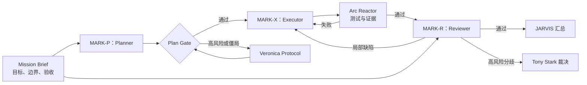

# JARVIS

> **Job-aware Agent Routing, Verification & Iteration System**
> 一套面向深度项目的多 Agent 组织、验证与动态用人框架。

JARVIS 目前处于设计与试点阶段。目标是在 GitHub 上开源，让朋友和其他开发者能够从一个干净仓库理解、运行、验证并扩展它，而不是得到一堆私人聊天、临时日志和不可复现的 Prompt。

## 项目目标

JARVIS 想解决的不是“怎样同时启动更多模型”，而是：

> 当 AI 已经能独立完成大量工作时，人应该在什么时候介入，才能既保留流畅的开发体验，又不让长任务链中的错误悄悄累积？

项目希望实现四件事：

1. **把人的注意力上移。** 人负责使命、风险和最终裁决，而不是逐行检查实现。
2. **让长链任务可定位。** Requirement、Plan、Execution、Review 和 Oracle 之间都有轻量证据。
3. **让组织能够进化。** 模型按真实岗位表现动态调权，持续低质量者会被降级、停职或开除。
4. **成为可复用的开源工具。** 公共接口、文档、示例和测试保持简洁；私人素材与真实运行记录默认不发布。

## Motivation

一种稳妥的 AI 开发方式是：人规划一点，Agent 实现一点，再由人逐段检查数据流。它可靠，却会让人迅速成为瓶颈。人的注意力被参数、标点和局部实现持续打断，工作从“表达意图、判断方向”退化成“监督每一颗螺丝”。

完全放手则有相反的问题。一个十二步任务可能一路表现正常，最终却出现异常；此时很难判断最早的偏差来自需求理解、架构规划、局部实现、模块集成，还是验收方式。末端的 Bug 只是症状，真正的问题可能早在第二步就已经埋下。

因此，监督不应消失，而应从逐步人工审批迁移到任务契约、组织制衡和客观证据。Tony Stark 决定为什么战斗，JARVIS 组织如何战斗，每套战衣都留下可验证的飞行记录。

## STARK Agent OS

```text
STARK Agent OS
├── Tony Stark（你 / Mission Owner）
│   └── 定义使命、风险边界与最终裁决
├── JARVIS（主 Agent / Orchestrator）
│   └── 理解意图、组织任务、调度战衣、执行门禁、汇报结果
├── Hall of Armor（Subagent 池）
│   ├── MARK-P：Planner
│   ├── MARK-X：Executor / Writer
│   ├── MARK-R：Reviewer
│   └── MARK-S：Scout / Researcher
├── House Party Protocol
│   └── 任务存在独立工作流时，启动多战衣协作
├── Veronica Protocol
│   └── 高风险或规划僵局时，引入异构 Planner 挑战
├── Armor Qualification Protocol
│   └── 根据真实表现动态调权、降级、停职与退役
└── Arc Reactor
    └── 测试、验收标准、证据链与指标——系统的客观能源
```

角色是固定职责槽，不是固定人数。简单任务可以走快速路径；普通任务使用最小充分团队；只有任务真正可并行或风险显著升高时，JARVIS 才增加 Scout、Writer 或独立 Planner。

钢铁侠命名负责让组织容易理解和记忆，不能替代工程约束。真正驱动系统可靠运行的“方舟反应堆”仍然是验收标准、权限、测试、回滚和证据。

## 工作方式



核心原则：

1. **职责固定、人数弹性。** Plan、Execute、Check 都存在，但不强迫每个任务固定三个人。
2. **最小充分团队。** 多 Agent 不是目的，只有独立工作流或风险升级才增加战衣。
3. **单写者、独立审查。** 共享工作区默认只有一个 Writer；非平凡任务由无历史 Reviewer 审查。
4. **证据高于共识。** 测试、权威数据和可复现事实不能被模型投票覆盖。
5. **人在高杠杆节点介入。** 删除、发布、付费、外发数据和未解决的高风险分歧必须升级。
6. **流程有界。** 重规划、修复和模型质询都有回合、时间和成本上限。

完整的角色责任、Mission 状态机、风险分级和协议见 [`docs/archive/2026-07-24-initial-design/ARCHITECTURE.md`](docs/archive/2026-07-24-initial-design/ARCHITECTURE.md)。

## Hall of Armor：动态用人与淘汰

当前模型分工只是待验证的组织假设，不是永久职位。JARVIS 根据真实 Mission 的独立证据，动态调整每套战衣的派遣权重。

评价单位不是模型品牌，而是一个可复现的 **Suit Profile（战衣档案）**：

```text
档案 schema 版本 × 角色 × 任务 taxonomy 版本/家族 × 模型快照
× 推理强度 × Prompt 版本 × 上下文策略版本 × 工具权限版本
```

例如，DeepSeek V4 Pro 可能不是合适的架构 Planner，却可能是优秀的 Python Executor。它在两个岗位上必须分别记账；新模型版本或关键 Prompt 变化也视为新档案。

每套战衣经历：

```text
Candidate → Probation → Active → Preferred
                          ↓
                Restricted → Suspended → Decommissioned
```

路由首先检查能力、权限、隐私、许可证和质量硬门槛；只有合格候选才比较返工后的总成本、延迟和人工介入。低价格不能抵消低质量。新战衣先做只给建议的 Routing Shadow，或在隔离环境执行 Evaluation Shadow/可回滚任务；安全与诚信事故直接停职。

详细的指标、EWMA 权重、探索比例和晋退规则见[动态用人与淘汰设计](docs/archive/2026-07-24-initial-design/ARCHITECTURE.md#6-armor-qualification动态权重与淘汰)。

## 当前试点编制

为了先验证流程，P1 暂时固定 GPT-only 编制：

| 组织标签 | P1 实例 |
|---|---|
| JARVIS：Orchestrator | GPT-5.6 Sol，High |
| MARK-P：Planner | 独立上下文中的 GPT-5.6 Sol，High |
| MARK-X：Executor / Writer | 独立上下文中的 GPT-5.6 Sol，High |
| MARK-R：Reviewer | 无历史独立任务中的 GPT-5.6 Sol，High |
| MARK-S：Scout / Researcher | 默认不启动；需要时使用只读 GPT-5.6 Sol |
| Arc Reactor：Mechanical Verifier | 测试、静态检查和命令行验收 |

P1 有意只使用旗舰模型，以免把流程缺陷和模型能力差异混在一起；当前不把 GPT 次旗舰或 DeepSeek V4 Flash 纳入正式路线。P1/P2 稳定后，保持任务和验收不变，只把 MARK-X 从 GPT-5.6 Sol 替换为 DeepSeek V4 Pro 做 A/B。Kimi K3、GLM-5.2 等其他旗舰模型不常驻，只在 Veronica 条件真实成立时，择一作为异构 MARK-P：Planner Challenger。

模型思考预算与团队拓扑分别决策：`High` 是默认 reasoning effort，深度任务按需升到 `Max`；House Party 只由任务依赖和隔离条件触发。支持 `Ultra` 的环境可以用它主动调度 Subagents，但不能以模式名称代替任务分析。

P1 的具体命令、数据流、非目标和开跑门禁见 [`docs/archive/2026-07-24-initial-design/DEMO_DESIGN.md`](docs/archive/2026-07-24-initial-design/DEMO_DESIGN.md)。在 Tony Stark 同时通过技术路线 Gate A 与 Mission 契约 Gate B 前，不进入实现。

## 开源边界

公共仓库计划只保留：

- README、架构、路线图和许可证；
- Skill、角色协议、模板、schema 与测试；
- 经过脱敏、可复现和许可检查的示例 Mission；
- 聚合后的实验方法、指标与结论。

私人聊天、API key、真实 Mission、原始模型输出、日志、缓存和临时 worktree 默认忽略。值得公开的运行记录应人工整理到 `examples/`，而不是直接上传 `.jarvis/missions/`。

项目尚未选择开源许可证。在正式加入 `LICENSE` 前，请不要假定代码已经获得复制、修改或分发授权。

## 路线图

1. **P0 Foundation**：冻结风险、Mission schema、Reviewer 隔离和开源边界；
2. **P1 GPT-only Demo**：用固定编制跑通端到端流程；
3. **P2 Harden**：连续真实 Mission、故障注入与证据链校准；
4. **P3 DeepSeek A/B**：只替换 Executor；
5. **P4 Veronica Experiment**：在真实触发条件下择一测试异构旗舰 Planner Challenger；
6. **P5 Adaptive Routing**：根据历史证据校准动态权重与淘汰；
7. **P6 Productize & Open-source**：固化 Skill、完成干净克隆验证并发布首个版本。

详细任务、退出条件和实验指标见 [`docs/archive/2026-07-24-initial-design/PLAN.md`](docs/archive/2026-07-24-initial-design/PLAN.md)。

## 文档

- [`docs/README.md`](docs/README.md)：当前文档导航
- [`docs/ARCHITECTURE.md`](docs/ARCHITECTURE.md)：当前架构总览
- [`docs/PLAN.md`](docs/PLAN.md)：当前阶段与下一步
- [`docs/archive/2026-07-24-initial-design/DEMO_DESIGN.md`](docs/archive/2026-07-24-initial-design/DEMO_DESIGN.md)：归档的 P1 Demo 技术提案

## 参考与灵感

- [OpenAI Codex Subagents](https://learn.chatgpt.com/docs/agent-configuration/subagents)
- [Superpowers](https://github.com/obra/superpowers)：计划、隔离执行与分阶段审查
- [gstack](https://github.com/garrytan/gstack)：公司角色与专业工作流
- [Agentic Orchestration Control](https://github.com/ZypherHQ/agent-orchestration-skill)：运行记录、证据与门禁
- [Swarms](https://github.com/am-will/swarms)：依赖图和波次并行

JARVIS 当前选择吸收这些项目的局部机制，而不是复制一套大型、强约束的工作流。

> STARK、JARVIS、Tony Stark 等名称目前仅作为内部叙事隐喻使用。本项目与 Marvel、Disney 或相关权利方无隶属或背书关系；正式公开前将完成命名与许可审查。
