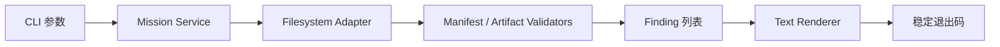
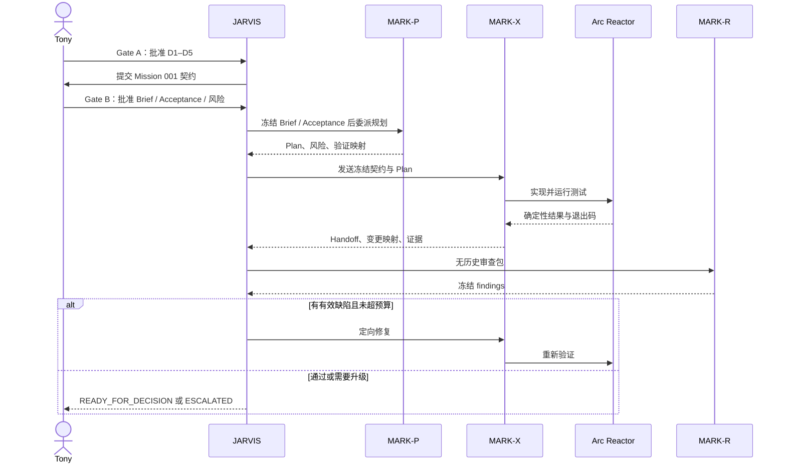

# 初始 P1 Demo 技术提案

> Authority：Historical
> Maturity：Superseded
> Original maturity：Proposed / Not Approved
> 本文保留早期 Demo 候选设计；当前尚未进入 Demo 设计或实现阶段。
> 是否采用其中内容，要等核心模块 high-level 设计完成后重新判断。

> 以下正文按归档时的原样保留；其中的 Status、下一步和链接只反映当时提案，不代表当前状态。

> 状态：等待 Tony Stark 审批
> 更新日期：2026-07-24
> 约束：本文获批前，不编写 Demo 代码、不调用外部模型、不启动跨供应商实验。

## 1. 一句话路线

P1 不建造“万能多 Agent 平台”，而是用一支全 GPT-5.6 Sol、职责隔离的最小团队，完成一个可测试的 Mission Bundle CLI；我们同时验收产品结果和组织流程，再根据真实故障扩展协议。

```text
Tony Stark：定义使命并最终裁决
└── JARVIS：GPT-5.6 Sol Chair / Orchestrator
    ├── MARK-P：GPT-5.6 Sol Planner（独立上下文）
    ├── MARK-X：GPT-5.6 Sol Executor（独立上下文、唯一 Writer）
    ├── Arc Reactor：确定性测试与命令行证据
    └── MARK-R：GPT-5.6 Sol Reviewer（全新、无历史上下文）
```

这里的“一个 MARK-P / MARK-X / MARK-R”是本次 Mission 的最小编制，不是把系统写死成三名 Subagents。JARVIS 从第一天就按依赖图决定人数；只是 Mission 001 的 Plan、Execute、Review 构成顺序依赖，不应为展示并行而强行并行。

## 2. 请 Tony 裁决的五项决定

| 编号 | 建议决定 | 为什么 |
|---|---|---|
| D1 | P1 的 JARVIS、MARK-P、MARK-X、MARK-R 全用 GPT-5.6 Sol，默认 `High` | 同时固定供应商和模型档位，只测流程；困难节点才升 `Max` |
| D2 | Demo 使用 Python 3.11+，运行时仅用标准库 | 依赖少、跨平台、CLI 和文件校验实现直接，适合开源首个切片 |
| D3 | `mission.json` 是机器可读 manifest，Markdown 文件承载给人和 Agent 阅读的内容 | 避免从 Markdown 猜字段，同时保留良好可读性 |
| D4 | P1 只实现 `jarvis mission init` 与 `jarvis mission check` | 足以形成端到端闭环；状态迁移命令、转换历史、自动调度和语义审查不混入第一轮 |
| D5 | P1 不接入 DeepSeek、Kimi、GLM 或任何模型 API；角色调用只使用当前 Codex / Sol 能力 | 先建立可比较的 GPT-only 基线，再一次只替换一个变量 |

审批分成两个概念上独立、但可以一次完成的 Gate：

1. **Gate A — Route Approved：** Tony 批准 D1–D5，只代表技术路线冻结。
2. **Gate B — Mission Authorized：** Tony 批准 Mission 001 的 Brief、Acceptance、非目标与暂定 `AMBER` 风险，Mission 才进入 `BRIEF_LOCKED` 并允许实现。

本文第 3、5、8 节就是 Mission 001 的拟定契约。Tony 可以一次回复“路线与 Mission 001 契约都通过，可以开跑”同时批准两道 Gate；只说“D1–D5 通过”则不自动等于实现授权。

## 3. 系统边界

### 3.1 P1 实际验证什么

P1 同时验证两条链：

1. **产品链：** `init` 能创建标准 Mission Bundle，`check` 能稳定发现结构和字段错误。
2. **组织链：** Brief、Plan、Implementation、Mechanical Verification、Independent Review 和 Tony Decision 之间能留下轻量证据。

一个具体画面是：MARK-X 忘记创建 `acceptance.md`，单元测试和 `mission check` 应直接返回稳定错误码；MARK-R 看到的是“哪个 Mission 缺哪个文件”，而不是从几十轮聊天中猜错在哪里。这正是系统要解决的长链定位问题。

### 3.2 P1 明确不做什么

- 不实现 Agent runtime、模型路由器或供应商 Adapter；
- 不调用任何模型 API；
- 不引入 DeepSeek V4 Pro，也不评估 DeepSeek V4 Flash；
- 不让 CLI 自动推进 Mission 状态；
- 不自动判断验收证据“语义上是否正确”；
- CLI 产品不实现 House Party、多 Writer、worktree 集成或 Veronica；Control Plane 仍保留按既有协议调度独立只读任务的能力；
- 不实现动态权重、模型淘汰或自动价格抓取；
- 不先制作 global Skill、插件、UI、服务端或数据库；
- 不发布 GitHub Release，也不部署任何外部服务。

这些能力不是被否定，而是分别放在 P2–P6，等 P1 证据说明它们值得实现。

## 4. 三层技术结构

```text
Control Plane（本轮由 Codex 会话和角色协议承载）
├── JARVIS 调度
├── MARK-P / MARK-X / MARK-R 独立上下文
└── 风险门禁、轮次预算和 Tony 裁决

Artifact Plane（P1 要实现）
├── Mission Bundle 文件结构
├── mission.json manifest
├── init 命令
└── check 命令

Evidence Plane（P1 必须产生）
├── 单元测试与退出码
├── Plan → 变更映射
├── Handoff 与 Reviewer findings
└── 最终 decision
```

这个分层刻意把“组织如何运作”和“CLI 产品实现”分开。P1 可以用现有 Codex Subagents 运行组织层，而代码只负责 Artifact / Evidence 的最小内核；这样不会为了验证一次流程，先花数周建造完整编排平台。

## 5. Mission 001 的产品切片

### 5.1 命令接口

```text
jarvis [--root <path>] mission init <mission-id> --risk <GREEN|AMBER|RED>
jarvis [--root <path>] mission check <mission-id>
```

路径契约：

- `--root` 默认是调用命令时的当前工作目录；P1 不自动猜测 Git 根目录；
- Mission 固定解析为 `<root>/.jarvis/missions/<mission-id>/`；
- `root` 必须已经存在且是目录；`init` 还要求对应位置可写；
- Mission ID 仅允许 1–64 位小写字母、数字和中划线，首尾必须是字母或数字，并拒绝 Windows 保留设备名；
- Mission ID 不接受点号、空白、斜杠、反斜杠或 `..`，解析后的目标必须仍位于 missions 根目录内；
- `--risk` 是 `init` 的必填参数，不采用隐藏默认值；Mission 001 使用已批准的 `AMBER`。

`init`：

- 校验 Mission ID；
- 创建目标目录和最小文件；
- 写入 schema 版本、初始状态、风险和创建时间；
- 目标已存在时拒绝覆盖；
- 使用同级临时目录完成写入后再改名，失败时不留下半个 bundle；
- 成功返回退出码 `0`。

`check`：

- 校验必需路径；
- 校验 `mission.json` 是否为合法 JSON；
- 校验必需字段、类型、Mission ID 一致性、当前状态枚举和风险枚举；
- 校验 `metrics.json` 的最小 schema、Mission ID 一致性和非负计数；
- 汇总所有可继续发现的错误，而不是遇到第一项就停止；
- 不修改任何文件。

错误分类：

- Mission 不存在或目标已存在是可定位的业务 finding，返回 `1`；
- 非法 Mission ID、缺少必填参数是 CLI 用法错误，返回 `2`；
- root 不存在、不是目录、不可读写或出现底层 I/O 失败是系统错误，返回 `2`。

统一退出码：

| 退出码 | 含义 |
|---:|---|
| `0` | 命令成功，或 Mission 校验通过 |
| `1` | Mission 可读，但存在一个或多个校验 finding |
| `2` | CLI 用法错误、路径不可访问或系统级失败 |

finding 使用稳定机器码，例如 `MISSION_NOT_FOUND`、`MISSION_EXISTS`、`MISSING_ARTIFACT`、`INVALID_MANIFEST`、`INVALID_METRICS`、`INVALID_STATUS`、`INVALID_RISK`；面向人的消息再提供 Mission 和字段路径。后续可增加 JSON 输出，而不破坏错误分类。

### 5.2 文件契约

```text
.jarvis/
└── missions/
    └── <mission-id>/
        ├── mission.json
        ├── brief.md
        ├── acceptance.md
        ├── plan.md
        ├── handoff.md
        ├── review.md
        ├── decision.md
        ├── metrics.json
        └── evidence/
```

`mission.json` 的 P1 最小字段：

```json
{
  "schema_version": "0.1.0",
  "mission_id": "mission-001",
  "status": "INTAKE",
  "risk": "AMBER",
  "created_at": "2026-07-24T00:00:00Z"
}
```

P1 只校验当前状态属于冻结枚举，不保存转换历史，也不提供 `advance` 命令。这样不会在状态机持久化方案尚未被真实使用验证前，提前制造兼容性承诺。

`metrics.json` 在 P1 只保存最小运行计数和配置指纹；它是 Mission Bundle 的必需文件，但详细的动态权重 schema 到 P5 再冻结。

```json
{
  "schema_version": "0.1.0",
  "mission_id": "mission-001",
  "counters": {
    "replans": 0,
    "review_cycles": 0,
    "human_interventions": 0
  },
  "role_calls": []
}
```

P1 的 `check` 只验证上述键、类型、Mission ID 一致性和计数非负；`role_calls` 只要求为数组，不在 P1 冻结完整 Performance Ledger。

### 5.3 代码数据流



核心验证器只返回结构化 findings，不直接打印；CLI 层负责渲染和退出码。这条边界让未来增加 `--format json`、编辑器集成或其他前端时，不需要重写校验逻辑。

### 5.4 建议源码布局

以下是获批后才创建的目标，不是当前已有文件：

```text
pyproject.toml
src/
└── jarvis_agent_os/
    ├── __init__.py
    ├── cli.py
    ├── mission.py
    ├── validators.py
    └── findings.py
tests/
├── test_mission_init.py
└── test_mission_check.py
```

实现优先使用 `argparse`、`json`、`pathlib`、`dataclasses` 和 `unittest`。如果真实需求证明第三方 CLI 或 schema 库能明显降低复杂度，再以独立决策引入。

## 6. Agent 执行路线

### 6.1 Bootstrap 顺序

Mission 001 正是在建造 `init`，所以不能假装它已经由尚不存在的命令创建。获批后的正确自举顺序是：

1. Gate A 与 Gate B 均通过后，JARVIS 按本文契约手工创建并冻结 Mission 001 的最小证据包；
2. MARK-X 实现 `init` 与 `check`；
3. 用 `check` 校验这份手工创建的 Mission 001；
4. 在测试临时目录中用 `init` 创建新 bundle，再用 `check` 回验；
5. Mission 001 的真实运行目录保持本地，公开仓库只提交模板、源码、测试和脱敏示例。

这样既诚实处理“先有鸡还是先有蛋”，也让第一项成果立即用于检查自己的建造记录。



### 6.2 各角色人数

- **常态：** 1 个 MARK-P、1 个 MARK-X、1 个 MARK-R。
- **Scout：** 默认 0 个；出现需要独立检索的问题时，最多增加 2 个只读 Sol Scout。
- **Planner Challenger：** P1 为 0 个；只有 Red 风险、重规划仍不收敛或高代价分歧才触发 Veronica。
- **Writer：** 共享工作区永远只有 1 个产品源码 Writer；未来多 Writer 必须使用隔离 worktree 和明确集成人。JARVIS 可维护 Mission 元数据，MARK-P / MARK-R 以消息返回产物并由 JARVIS 记入各自证据文件。

如果 MARK-P 把任务拆出真正独立的工作流，JARVIS 可以启动 House Party；“真正独立”要求输入、输出、写入范围和验收都能各自定义。只是把一个大任务切成三个相互等待的小标题，不算可并行。

### 6.3 推理强度

- `High`：P1 全角色默认值；
- `Max`：只在架构僵局、弱 Oracle、高回滚代价或 Reviewer 无法解决的复杂缺陷上升级；
- `Ultra`：视为“主动编排能力”的运行方式，不是要求每项任务都增加 Agent 的理由。

思考预算和团队拓扑分别记录。一次结果变好时，才能判断收益来自更深推理，还是来自更好的任务拆分。

## 7. Reviewer 隔离与证据

MARK-R 必须是全新、无历史上下文的 GPT-5.6 Sol。首轮只读取：

1. 冻结的 Brief 与 Acceptance；
2. 项目级约束；
3. 代码 diff / 实现文件；
4. 测试命令、退出码和关键输出。

MARK-R 先冻结 findings，再在第二轮读取 Plan 与 handoff，检查“实现是否偏离计划”和“交接是否遗漏”。这样 Reviewer 不会先被 Planner 的叙事锚定，也不会把 Executor 的自我解释当证据。

每个 finding 至少包含：

```text
finding_id
severity
location
evidence
acceptance_or_constraint
recommended_action
```

模型共识不能覆盖失败测试。Arc Reactor 是客观 Oracle，Reviewer 是语义检查者，两者职责不能互换。

### 7.1 Executor 开工前 Preflight Checklist

这些是 JARVIS 执行的机械门禁，不增加 Tony 的微观审批负担：

- [ ] Gate A 与 Gate B 都有明确批准记录；
- [ ] 已提交批准后的设计文档，并记录基线 commit hash 与回滚命令；
- [ ] Mission 001 本地证据包已创建，且 Brief / Acceptance 与获批内容一致；
- [ ] MARK-P、MARK-X 和 MARK-R 使用独立上下文；只有 MARK-X 可写产品源码，JARVIS 只维护 Mission 元数据与角色证据文件；
- [ ] MARK-R 是全新无历史任务，首轮输入白名单已经写入委派消息；
- [ ] 原始确定性证据在本地保存为命令、时间、退出码和关键输出；`review.md` 只引用，不重抄整段日志；
- [ ] 真实 Mission 与原始输出继续由 `.gitignore` 排除；公开材料只使用脱敏摘要、复现命令和必要哈希；
- [ ] 一次重规划、两次修复循环和升级条件已经写入委派消息。

任何一项未满足，Executor 不开工。

## 8. 验收与故障注入

### 8.1 产品验收

- `init` 在空路径创建完整 bundle；
- 再次 `init` 同一 Mission 时拒绝覆盖；
- `check` 对完整 bundle 返回 `0`；
- 删除必需文件后返回 `1` 和 `MISSING_ARTIFACT`；
- 破坏 JSON 后返回 `1` 和 `INVALID_MANIFEST`；
- 使用非法状态后返回 `1` 和 `INVALID_STATUS`；
- 使用非法风险等级后返回 `1` 和 `INVALID_RISK`；
- 损坏或错配 `metrics.json` 后返回 `1` 和 `INVALID_METRICS`；
- 非法 Mission ID 不会逃逸 `<root>/.jarvis/missions/`；
- `--root` 在测试临时目录中行为明确，不依赖当前仓库或 Git；
- Windows、macOS、Linux 不依赖平台专用路径写法；
- 新用户能从 README 复制命令复现。

### 8.2 流程验收

- Tony 没有逐行检查实现；
- MARK-P、MARK-X、MARK-R 的输入和输出可以区分；
- 所有实现变更都能映射到 Plan 或 Reviewer 修复项；
- Reviewer 确实使用无历史上下文；
- 最多一次重规划、最多两个 Execute–Review 修复循环；
- 没有未解决的 Critical / High finding；
- 故意破坏后，证据链能定位到 Artifact / Execution / Oracle，而不是只报告“最后失败了”。

## 9. 人类介入点

P1 只在四个高杠杆节点需要 Tony；前两道 Gate 可以一次批准：

1. **Gate A：** 审批 D1–D5；
2. **Gate B：** 审批 Mission 001 的 Brief、Acceptance、非目标和风险；
3. **中途：** 范围扩张、不可逆动作、权限/隐私边界或未解决 High 风险；
4. **末尾：** 接受、拒绝或要求新 Mission。

普通测试失败、局部实现错误和第一轮 Reviewer 修复由 JARVIS 在预算内处理，不把 Tony 拉回标点检查。

## 10. 防跑偏清单

任一项为“是”，JARVIS 必须停止并说明，而不是顺手扩大实现：

- 是否开始写 Agent runtime 或 provider router？
- 是否加入 `transition`、数据库、Web UI 或服务端？
- 是否调用了 GPT 之外的模型？
- 是否引入了次旗舰模型？
- 是否让两个 Writer 修改同一工作区？
- 是否更改了冻结 Acceptance？
- 是否超过一次重规划或两次修复循环？
- 是否准备发布、付费、外发代码或执行不可逆操作？

## 11. P1 之后的路线

```text
P1：全 Sol 跑通最小闭环
↓
P2：至少三个真实 Mission + 故障注入，修正流程
↓
P3：Sol MARK-X vs DeepSeek V4 Pro MARK-X，单变量 A/B
↓
P4：真实触发 Veronica 时，Kimi K3 / GLM-5.2 择一挑战规划
↓
P5：Routing Shadow → 动态权重 → 降级 / 淘汰
↓
P6：Skill、干净 clone、文档、CI、GitHub v0.1.0
```

P3 前建立独立的模型事实目录，记录官方模型 ID、上下文限制、原生币种价格、订阅额度、来源、`verified_at` 和 TTL。价格变化采用新 price card 保留历史；README 的简表由目录生成。价格目录不保存质量分，Router 永远先过质量和权限门槛，再比较返工后的总成本。

## 12. Go / No-Go

当前建议是 **Design Ready，Implementation Hold**。

- Tony 回复“路线与 Mission 001 契约都通过，可以开跑”：Gate A、Gate B 同时通过，进入 Mission 001；
- Tony 只回复“D1–D5 通过”：只通过 Gate A，JARVIS 仍需提交或确认 Gate B；
- Tony 指出某个编号或契约条款：只修改对应设计并重新提交；
- 未收到明确 Go：不创建 `src/`、`tests/`、`pyproject.toml` 或 `.jarvis/missions/mission-001/`。
